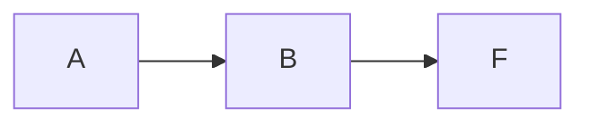
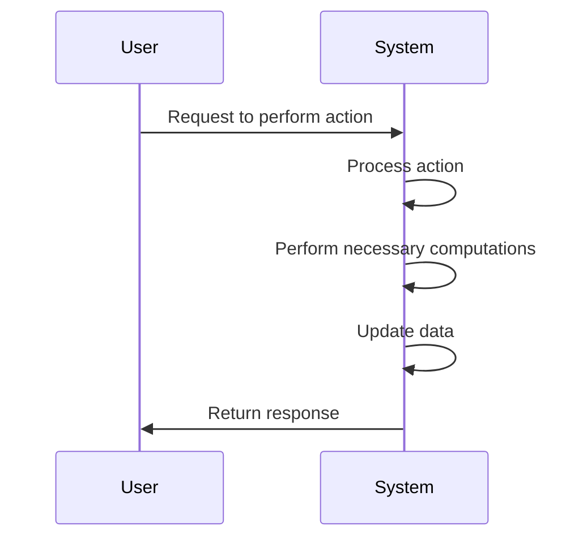

# Embedded Markdown

## A simple left to right graph
     

``` mermaid
graph LR;
    A-->B;
    B-->F;
```

## Sample for a simple SequenceDiagram

```mermaid
sequenceDiagram
    participant User
    participant System
    User->>System: Request to perform action
    System->>System: Process action
    System->>System: Perform necessary computations
    System->>System: Update data
    System->>User: Return response
```